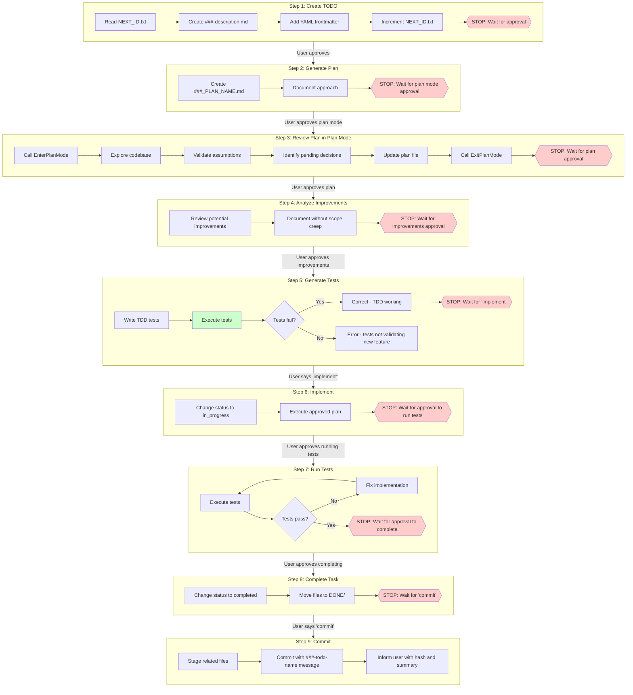

# TODO Workflow Diagram

Visual representation of the 9-step TODO workflow.

## Flowchart

## Legend

| Color | Meaning |
|-------|---------|
| Red nodes | BLOCKER - Requires user approval to proceed |
| Green node | AUTOMATIC - Only action that runs without asking |

## Step Summary

| Step | Action | Blocker |
|------|--------|---------|
| 1 | Create TODO file | User must approve |
| 2 | Create plan file | User must approve plan mode |
| 3 | Validate plan in plan mode | User must approve plan |
| 4 | Analyze improvements | User must approve |
| 5 | Generate and run tests | User must say "implement" |
| 6 | Implement the plan | User must approve test run |
| 7 | Run tests | User must approve completion |
| 8 | Move files to DONE/ | User must say "commit" |
| 9 | Commit changes | None (final step) |

## Key Rules

1. **Never skip steps** - Each step must complete before the next
2. **Never combine steps** - Each step is atomic
3. **Never assume approval** - Wait for explicit user confirmation
4. **Only one auto-action** - Test execution in Step 5 is the only automatic action
