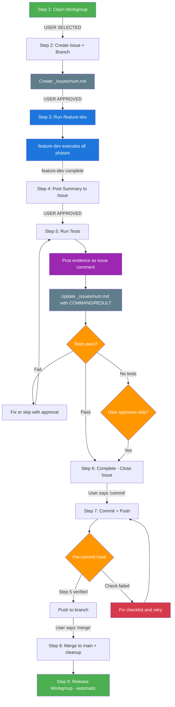
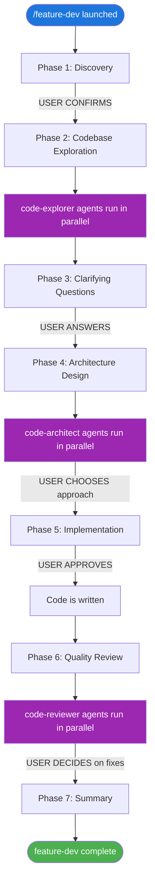
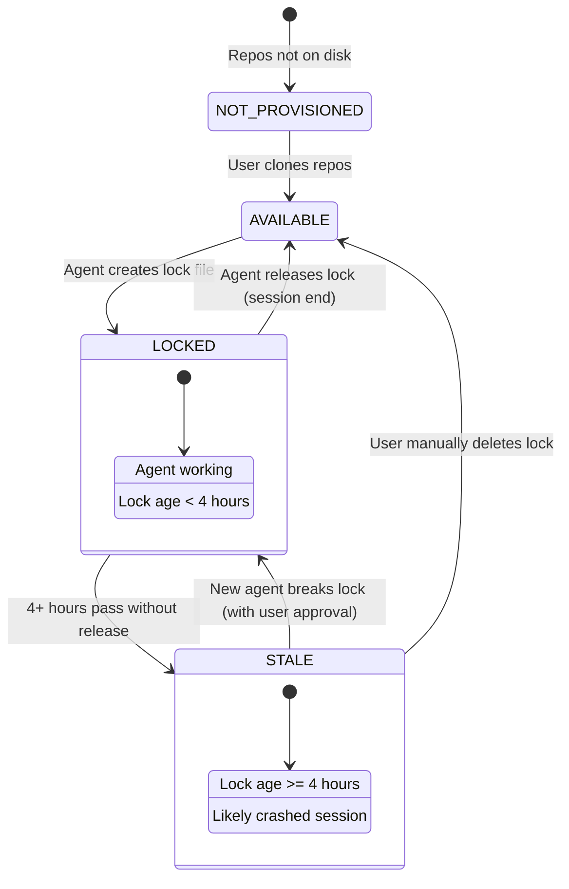
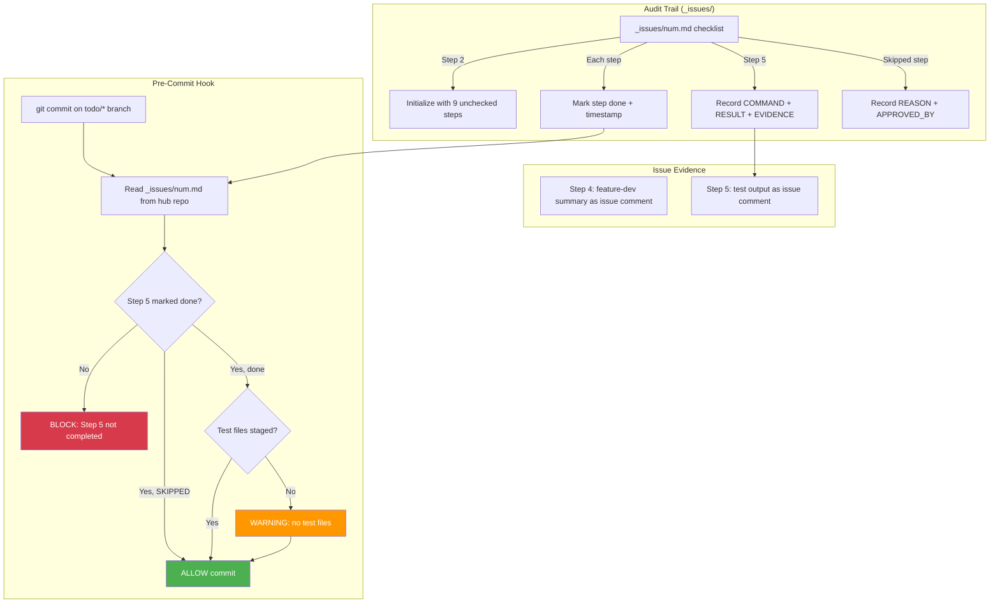

# Workflow Diagrams

Visual representations of the four systems in todo-workflow.

## 1. 9-Step Workflow (with feature-dev Integration)

```mermaid
flowchart TD
    S1[Step 1: Claim Workgroup] -->|USER SELECTED| S2
    S2[Step 2: Create Issue + Branch] --> CL2[Create _issues/num.md]
    CL2 -->|USER APPROVED| S3
    S3[Step 3: Run /feature-dev] --> FD[feature-dev executes all phases]
    FD -->|feature-dev complete| S4
    S4[Step 4: Post Summary to Issue] -->|USER APPROVED| S5
    S5[Step 5: Run Tests] --> EV5[Post evidence as issue comment]
    EV5 --> CL5[Update _issues/num.md with COMMAND/RESULT]
    CL5 --> RESULT{Tests pass?}
    RESULT -->|Pass| S6
    RESULT -->|Fail| FIX[Fix or skip with approval] --> S5
    RESULT -->|No tests| SKIP{User approves skip?}
    SKIP -->|Yes| S6
    S6[Step 6: Complete - Close Issue] -->|User says 'commit'| S7
    S7[Step 7: Commit + Push] --> HOOK{Pre-commit hook}
    HOOK -->|Step 5 verified| S7OK[Push to branch]
    HOOK -->|Check failed| S7FAIL[Fix checklist and retry]
    S7FAIL --> S7
    S7OK -->|User says 'merge'| S8
    S8[Step 8: Merge to main + cleanup] --> S9
    S9[Step 9: Release Workgroup - automatic]

    style S1 fill:#4CAF50,color:#fff
    style S3 fill:#1D76DB,color:#fff
    style S9 fill:#4CAF50,color:#fff
    style RESULT fill:#FF9800,color:#fff
    style SKIP fill:#FF9800,color:#fff
    style HOOK fill:#FF9800,color:#fff
    style S7FAIL fill:#D73A4A,color:#fff
    style EV5 fill:#9C27B0,color:#fff
    style CL2 fill:#607D8B,color:#fff
    style CL5 fill:#607D8B,color:#fff
    style FD fill:#1D76DB,color:#fff
```

### Step Summary

| Step | Action | Waits For |
|------|--------|-----------|
| 1 | Claim workgroup (lock, verify, pull) | User selects workgroup |
| 2 | Create issue + branch + checklist | User approval |
| 3 | Run /feature-dev (exploration, architecture, implementation, review) | feature-dev internal pauses |
| 4 | Post structured summary as issue comment | User approval |
| 5 | Run tests (or skip with reason) | User approval |
| 6 | Close issue | User says "commit" |
| 7 | Commit + push to branch | User says "merge" |
| 8 | Merge to main, delete branches | Completion |
| 9 | Release workgroup lock | Automatic |

### Checkpoint Verification

| Transition | What Must Be True |
|------------|-------------------|
| start -> 1 | Workgroup status displayed, USER SELECTED workgroup |
| 1 -> 2 | Lock created, repos verified, git pulled, USER APPROVED |
| 2 -> 3 | Issue created, branch created, checklist created, USER APPROVED |
| 3 -> 4 | feature-dev completed all phases, USER APPROVED |
| 4 -> 5 | Summary posted as issue comment, USER APPROVED |
| 5 -> 6 | Tests run or skipped with reason, USER APPROVED |
| 6 -> 7 | Issue closed, USER SAID "commit" |
| 7 -> 8 | Committed and pushed, USER SAID "merge" |
| 8 -> 9 | All branches merged, pushed, deleted. Automatic. |

## 2. feature-dev Internal Flow (Step 3)

```mermaid
flowchart TD
    START([/feature-dev launched]) --> P1
    P1[Phase 1: Discovery] -->|USER CONFIRMS| P2
    P2[Phase 2: Codebase Exploration] --> P2A[code-explorer agents run in parallel]
    P2A --> P3
    P3[Phase 3: Clarifying Questions] -->|USER ANSWERS| P4
    P4[Phase 4: Architecture Design] --> P4A[code-architect agents run in parallel]
    P4A -->|USER CHOOSES approach| P5
    P5[Phase 5: Implementation] -->|USER APPROVES| P5A[Code is written]
    P5A --> P6
    P6[Phase 6: Quality Review] --> P6A[code-reviewer agents run in parallel]
    P6A -->|USER DECIDES on fixes| P7
    P7[Phase 7: Summary] --> DONE([feature-dev complete])

    style START fill:#1D76DB,color:#fff
    style DONE fill:#4CAF50,color:#fff
    style P2A fill:#9C27B0,color:#fff
    style P4A fill:#9C27B0,color:#fff
    style P6A fill:#9C27B0,color:#fff
```

## 3. Session Startup (Step 1 Detail)

```mermaid
flowchart TD
    START([New Session]) --> READ[Read workgroups/*.lock files]
    READ --> DISPLAY[Display workgroup status table]
    DISPLAY --> ASK[Ask user: which workgroup?]
    ASK --> WAIT{User responds?}
    WAIT -->|No| ASK
    WAIT -->|Yes| CHECK{Workgroup status?}

    CHECK -->|AVAILABLE| LOCK[Create lock file]
    CHECK -->|NOT PROVISIONED| CLONE[Ask user to clone repos]
    CHECK -->|STALE| BREAK{Ask user: break lock?}
    CHECK -->|LOCKED| PICK[Pick different workgroup]

    BREAK -->|Yes| DELETE[Delete old lock] --> LOCK
    BREAK -->|No| PICK
    PICK --> ASK
    CLONE --> LOCK

    LOCK --> VERIFY[Verify repos exist on disk]
    VERIFY --> ANNOUNCE[Set active paths]
    ANNOUNCE --> PULL[Git pull all active repos]
    PULL --> READY([Ready for Step 2])

    style START fill:#4CAF50,color:#fff
    style READY fill:#4CAF50,color:#fff
    style WAIT fill:#FF9800,color:#fff
    style BREAK fill:#FF9800,color:#fff
```

## 4. Workgroup Lock States

```mermaid
stateDiagram-v2
    [*] --> NOT_PROVISIONED: Repos not on disk

    NOT_PROVISIONED --> AVAILABLE: User clones repos
    AVAILABLE --> LOCKED: Agent creates lock file
    LOCKED --> AVAILABLE: Agent releases lock (session end)
    LOCKED --> STALE: 4+ hours pass without release
    STALE --> LOCKED: New agent breaks lock (with user approval)
    STALE --> AVAILABLE: User manually deletes lock

    state LOCKED {
        [*] --> Active
        Active: Agent working
        Active: Lock age < 4 hours
    }

    state STALE {
        [*] --> Expired
        Expired: Lock age >= 4 hours
        Expired: Likely crashed session
    }
```

## 5. Enforcement Layer

```mermaid
flowchart TD
    subgraph AUDIT["Audit Trail (_issues/)"]
        CL[_issues/num.md checklist]
        CL --> |Step 2| INIT[Initialize with 9 unchecked steps]
        CL --> |Each step| UPDATE[Mark step done + timestamp]
        CL --> |Step 5| EVIDENCE[Record COMMAND + RESULT + EVIDENCE]
        CL --> |Skipped step| SKIP_REC[Record REASON + APPROVED_BY]
    end

    subgraph GITHUB["Issue Evidence"]
        S4_COMMENT[Step 4: feature-dev summary as issue comment]
        S5_COMMENT[Step 5: test output as issue comment]
    end

    subgraph HOOK["Pre-Commit Hook"]
        COMMIT[git commit on todo/* branch]
        COMMIT --> READ[Read _issues/num.md from hub repo]
        READ --> CHECK5{Step 5 marked done?}
        CHECK5 -->|No| REJECT[BLOCK: Step 5 not completed]
        CHECK5 -->|Yes, SKIPPED| ALLOW[ALLOW commit]
        CHECK5 -->|Yes, done| TESTS{Test files staged?}
        TESTS -->|Yes| ALLOW
        TESTS -->|No| WARN[WARNING: no test files] --> ALLOW
    end

    EVIDENCE --> S5_COMMENT
    UPDATE --> READ

    style REJECT fill:#D73A4A,color:#fff
    style ALLOW fill:#4CAF50,color:#fff
    style WARN fill:#FF9800,color:#fff
```

### How the Three Layers Connect

| Layer | Purpose | When |
|-------|---------|------|
| `_issues/<num>.md` checklist | Audit trail of every step | Updated at each step transition |
| GitHub issue comments | Visible evidence of development and testing | Posted at Steps 4 and 5 |
| Pre-commit hook | Enforcement gate | Fires at Step 7 (commit) |

The checklist is the source of truth. The issue comments provide human-readable evidence. The hook prevents commits when the checklist is incomplete.

## Key Rules

1. **Every step requires explicit user approval** (except Step 9 which is automatic)
2. **Merge to main requires explicit "merge" command** - "commit" and "push" are NOT "merge"
3. **Lock files are ephemeral** - gitignored, auto-expire after 4 hours
4. **Branches follow `todo/<num>-<repo>` convention** - the repo suffix prevents collisions
5. **Silent skipping is blocked** - the pre-commit hook enforces checklist completion
6. **Skipping is allowed but recorded** - the hook does not ban skipping, it bans *unrecorded* skipping
7. **feature-dev is mandatory for Step 3** - it handles exploration, architecture, implementation, and quality review
