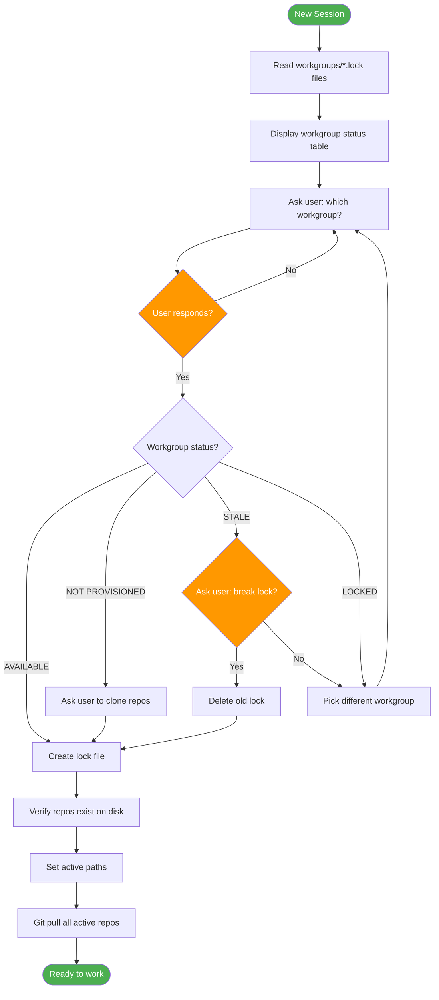
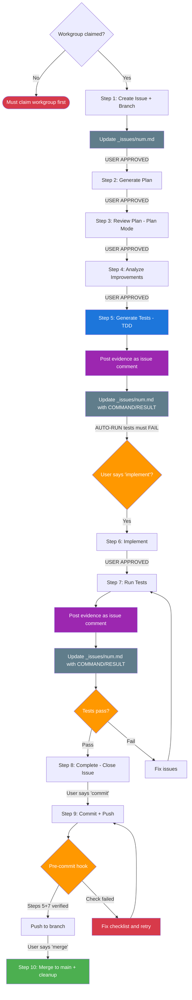
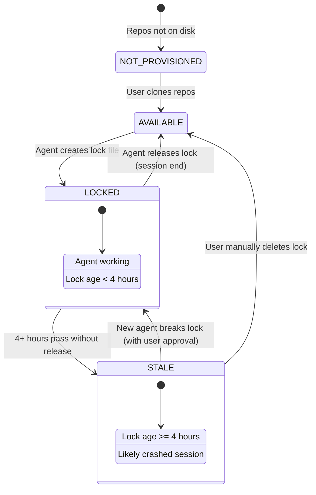
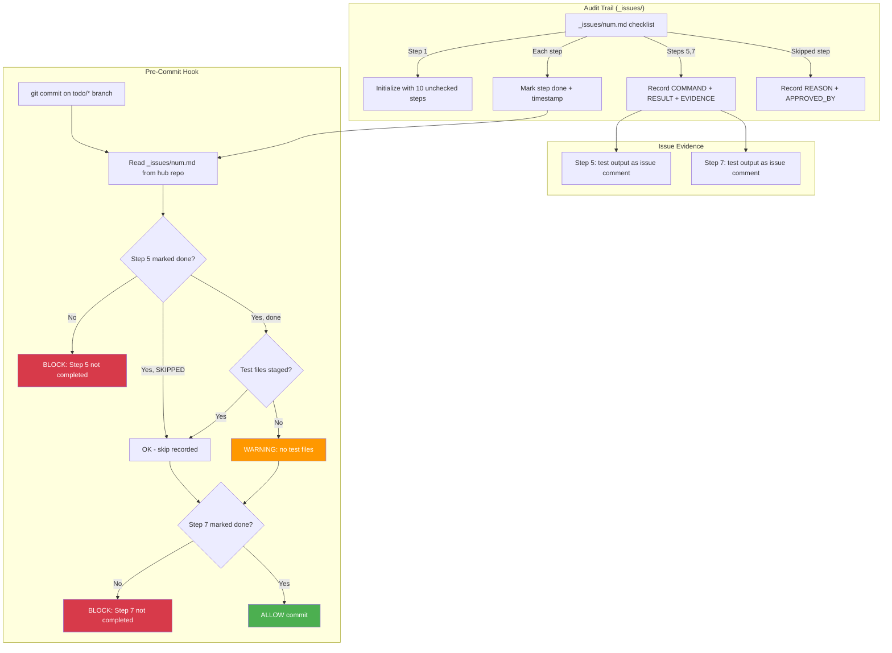

# Workflow Diagrams

Visual representations of the four systems in todo-workflow.

## 1. Session Startup Protocol

```mermaid
flowchart TD
    START([New Session]) --> READ[Read workgroups/*.lock files]
    READ --> DISPLAY[Display workgroup status table]
    DISPLAY --> ASK[Ask user: which workgroup?]
    ASK --> WAIT{User responds?}
    WAIT -->|No| ASK
    WAIT -->|Yes| CHECK{Workgroup status?}

    CHECK -->|AVAILABLE| LOCK[Create lock file]
    CHECK -->|NOT PROVISIONED| CLONE[Ask user to clone repos]
    CHECK -->|STALE| BREAK{Ask user: break lock?}
    CHECK -->|LOCKED| PICK[Pick different workgroup]

    BREAK -->|Yes| DELETE[Delete old lock] --> LOCK
    BREAK -->|No| PICK
    PICK --> ASK
    CLONE --> LOCK

    LOCK --> VERIFY[Verify repos exist on disk]
    VERIFY --> ANNOUNCE[Set active paths]
    ANNOUNCE --> PULL[Git pull all active repos]
    PULL --> READY([Ready to work])

    style START fill:#4CAF50,color:#fff
    style READY fill:#4CAF50,color:#fff
    style WAIT fill:#FF9800,color:#fff
    style BREAK fill:#FF9800,color:#fff
```

## 2. 10-Step GitHub Issues Workflow

```mermaid
flowchart TD
    PRE{Workgroup claimed?}
    PRE -->|No| BLOCK([Must claim workgroup first])
    PRE -->|Yes| S1

    S1[Step 1: Create Issue + Branch] --> CL1[Update _issues/num.md]
    CL1 -->|USER APPROVED| S2
    S2[Step 2: Generate Plan] -->|USER APPROVED| S3
    S3[Step 3: Review Plan - Plan Mode] -->|USER APPROVED| S4
    S4[Step 4: Analyze Improvements] -->|USER APPROVED| S5
    S5[Step 5: Generate Tests - TDD] --> EV5[Post evidence as issue comment]
    EV5 --> CL5[Update _issues/num.md with COMMAND/RESULT]
    CL5 -->|AUTO-RUN tests must FAIL| WAIT5
    WAIT5{User says 'implement'?} -->|Yes| S6
    S6[Step 6: Implement] -->|USER APPROVED| S7
    S7[Step 7: Run Tests] --> EV7[Post evidence as issue comment]
    EV7 --> CL7[Update _issues/num.md with COMMAND/RESULT]
    CL7 --> RESULT{Tests pass?}
    RESULT -->|Pass| S8
    RESULT -->|Fail| FIX[Fix issues] --> S7
    S8[Step 8: Complete - Close Issue] -->|User says 'commit'| S9
    S9[Step 9: Commit + Push] --> HOOK{Pre-commit hook}
    HOOK -->|Steps 5+7 verified| S9OK[Push to branch]
    HOOK -->|Check failed| S9FAIL[Fix checklist and retry]
    S9FAIL --> S9
    S9OK -->|User says 'merge'| S10
    S10[Step 10: Merge to main + cleanup]

    style BLOCK fill:#D73A4A,color:#fff
    style S5 fill:#1D76DB,color:#fff
    style S10 fill:#4CAF50,color:#fff
    style WAIT5 fill:#FF9800,color:#fff
    style RESULT fill:#FF9800,color:#fff
    style HOOK fill:#FF9800,color:#fff
    style S9FAIL fill:#D73A4A,color:#fff
    style EV5 fill:#9C27B0,color:#fff
    style EV7 fill:#9C27B0,color:#fff
    style CL1 fill:#607D8B,color:#fff
    style CL5 fill:#607D8B,color:#fff
    style CL7 fill:#607D8B,color:#fff
```

### Step Summary

| Step | Action | Waits For |
|------|--------|-----------|
| 1 | Create issue + branch | User approval |
| 2 | Generate plan (issue comment) | User approval |
| 3 | Review plan (EnterPlanMode) | User approval |
| 4 | Analyze improvements | User approval |
| 5 | Generate tests (auto-run, must FAIL) | User says "implement" |
| 6 | Implement approved plan | User approval |
| 7 | Run tests (must PASS) | User approval |
| 8 | Close issue | User says "commit" |
| 9 | Commit + push to branch | User says "merge" |
| 10 | Merge to main, delete branches | Completion |

### Checkpoint Verification

| Transition | What Must Be True |
|------------|-------------------|
| start -> 1 | Workgroup claimed, lock file exists |
| 1 -> 2 | Issue created, branch created, USER APPROVED |
| 2 -> 3 | Plan added as comment, USER APPROVED |
| 3 -> 4 | Plan reviewed in plan mode, USER APPROVED |
| 4 -> 5 | Improvements analyzed, USER APPROVED |
| 5 -> 6 | Tests written and FAILED, USER SAID "implement" |
| 6 -> 7 | Implementation complete, USER APPROVED |
| 7 -> 8 | All tests PASS, USER APPROVED |
| 8 -> 9 | Issue closed, USER SAID "commit" |
| 9 -> 10 | Committed and pushed, USER SAID "merge" |
| 10 -> done | All branches merged, pushed, deleted |

## 3. Workgroup Lock States

```mermaid
stateDiagram-v2
    [*] --> NOT_PROVISIONED: Repos not on disk

    NOT_PROVISIONED --> AVAILABLE: User clones repos
    AVAILABLE --> LOCKED: Agent creates lock file
    LOCKED --> AVAILABLE: Agent releases lock (session end)
    LOCKED --> STALE: 4+ hours pass without release
    STALE --> LOCKED: New agent breaks lock (with user approval)
    STALE --> AVAILABLE: User manually deletes lock

    state LOCKED {
        [*] --> Active
        Active: Agent working
        Active: Lock age < 4 hours
    }

    state STALE {
        [*] --> Expired
        Expired: Lock age >= 4 hours
        Expired: Likely crashed session
    }
```

## 4. Enforcement Layer

```mermaid
flowchart TD
    subgraph AUDIT["Audit Trail (_issues/)"]
        CL[_issues/num.md checklist]
        CL --> |Step 1| INIT[Initialize with 10 unchecked steps]
        CL --> |Each step| UPDATE[Mark step done + timestamp]
        CL --> |Steps 5,7| EVIDENCE[Record COMMAND + RESULT + EVIDENCE]
        CL --> |Skipped step| SKIP[Record REASON + APPROVED_BY]
    end

    subgraph GITHUB["Issue Evidence"]
        S5_COMMENT[Step 5: test output as issue comment]
        S7_COMMENT[Step 7: test output as issue comment]
    end

    subgraph HOOK["Pre-Commit Hook"]
        COMMIT[git commit on todo/* branch]
        COMMIT --> READ[Read _issues/num.md from hub repo]
        READ --> CHECK5{Step 5 marked done?}
        CHECK5 -->|No| REJECT5[BLOCK: Step 5 not completed]
        CHECK5 -->|Yes, SKIPPED| PASS5[OK - skip recorded]
        CHECK5 -->|Yes, done| TESTS{Test files staged?}
        TESTS -->|Yes| PASS5
        TESTS -->|No| WARN[WARNING: no test files]
        PASS5 --> CHECK7{Step 7 marked done?}
        WARN --> CHECK7
        CHECK7 -->|No| REJECT7[BLOCK: Step 7 not completed]
        CHECK7 -->|Yes| ALLOW[ALLOW commit]
    end

    EVIDENCE --> S5_COMMENT
    EVIDENCE --> S7_COMMENT
    UPDATE --> READ

    style REJECT5 fill:#D73A4A,color:#fff
    style REJECT7 fill:#D73A4A,color:#fff
    style ALLOW fill:#4CAF50,color:#fff
    style WARN fill:#FF9800,color:#fff
```

### How the Three Layers Connect

| Layer | Purpose | When |
|-------|---------|------|
| `_issues/<num>.md` checklist | Audit trail of every step | Updated at each step transition |
| GitHub issue comments | Visible evidence of test execution | Posted at Steps 5 and 7 |
| Pre-commit hook | Enforcement gate | Fires at Step 9 (commit) |

The checklist is the source of truth. The issue comments provide human-readable evidence. The hook prevents commits when the checklist is incomplete.

## Key Rules

1. **Every step requires explicit user approval** (except Step 5 auto-run)
2. **Merge to main requires explicit "merge" command** - "commit" and "push" are NOT "merge"
3. **Lock files are ephemeral** - gitignored, auto-expire after 4 hours
4. **Branches follow `todo/<num>-<repo>` convention** - the repo suffix prevents collisions
5. **Silent skipping is blocked** - the pre-commit hook enforces checklist completion
6. **Skipping is allowed but recorded** - the hook does not ban skipping, it bans *unrecorded* skipping
